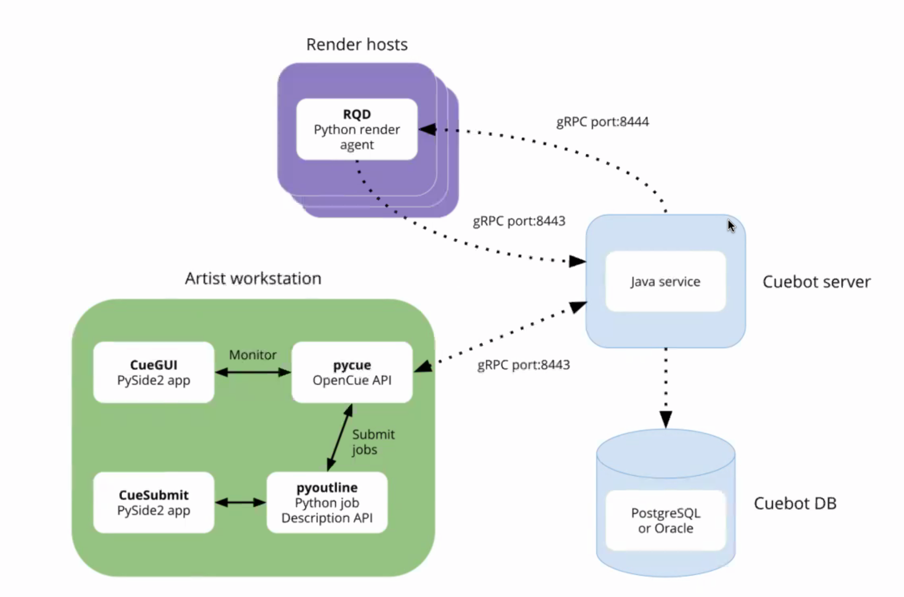

---
parent: Meetings
title: "2019-02-27"
----

# **AWSF TAC Meeting - February 27, 2019**

## **Voting member attendance**

* [x] Daniel Heckenberg - Chairperson, Animal Logic Pty Ltd
* [ ] Gordon Bradley, Autodesk
* [ ] Mark McGuire, Blue Sky Studios, Inc.
* [ ] Michael O’Gorman, Cisco Systems Inc. 
* [x] Henry Vera, Double Negative 
* [ ] Bill Ballew, DreamWorks Animation 
* [x] Matt Kuhlenschmidt, Epic Games, Inc. 
* [x] Brian Cipriano, Google 
* [ ] Jim Jeffers, Intel Corporation 
* [x] Larry Gritz, Sony Pictures Imageworks
* [x] Jean-Francois Panisset, VES Technology Committee 
* [x] Cory Omand, The Walt Disney Studios 
* [ ] Kimball Thurston, Weta Digital Limited 
* [ ] Eric Enderton, NVIDIA
* [ ] Ken Museth, OpenVDB Representative 
* [x] Michael Dolan, OpenColorIO Representative

## **Other Attendees**

* Mike Dolan, Linux Foundation
* Thanh Ha, Linux Foundation
* Bernard Lefebvre, Spiria / OpenColorIO
* Todd Prives, Google
* Doug Walker, Autodesk
* Patrick Hodoul, Autodesk
* Robert Vinluan, Side Effects
* Andrew Pearce, Dreamworks

## **Apologies**

* Kimbal Thurston, WETA Digital Limited
* David Morin, ASWF
* John Mertic, Linux Foundation

# **Agenda**

Welcome to Michael Dolan, color scientist at Sony Imageworks, OCIO TAC Chair.

* Goals for TAC: Year 1
    * 6 projects adopted
        * CI infrastructure
            * VFX Reference Platform based dependencies
            * Builds for DCC plugins
            * Static analysis to assist CII badge criteria
        * Stretch goals:
            * Downloadable and installable artefacts
            * Windows, Mac support
            * GPU support

* Face to Face meeting summary
    * Strong interest in GPU, Mac/Windows platform
    * Versioning:[ Semantic Versioning](https://semver.org/)
        * Should the foundation take a strong position on versioning practices?
        * Semantic versioning may be most sensible option, but some projects such as OpenVDB somewhat diverging from that practice, USD using a very different scheme.
    * Security working group
        * Requirements for CII badge: identifying and addressing vulnerabilities
        * From history of OpenEXR presentation, when it became part of documented vulnerabilities (official CVEs)
        * Assistance offered from Intel, Apple, DNeg, DWA
        * Will create a working group on security
    * Non-software projects
        * Is the ASWF the right place to host these projects?
        * WikiHuman project, production datasets for comparison and testing (Disney Moana dataset)
        * Could help with IP issues, ability to contribute
        * Definite interest

* Technical Project updates
    * OpenVDB: Dan Bailey (ILM), on OpenVDB TAC.
        * Moving to a 2 week cycle for TAC meetings
        * Outstanding list of admin-related tasks: deprecation strategy, which years of VFX Reference Platform to support, moving to sptx as scheme for license info in files, documentation…
        * Also discussing future priorities
        * Proposal for SIGGRAPH course for summer 2019
        * Triage projects from contributors
        * Nick from DNeg working on CMake, with help from Intel
        * Looking at CI transition (Travis to Jenkins)
    * OpenColorIO: Mike Dolan (SPI), chair for OCIO TAC
        * Working on process of passing all legal checks to hand over GitHub repo to ASWF
        * Investigation on updating CI infrastructure, first goal is Linux builds on Jenkins LF infrastructure. Will keep current Travis infrastructure for Mac / Windows builds until that’s supported by ASWF/LF infrastructure.
        * License scan for dependencies, figuring out if upstream dependencies can be pulled from active projects, or forked / cloned if projects are not active.
        * Working on patch / minor release on top of 1.1 release from 1 year ago, bug fixes, OpenImageIO compatibility. Looking to cherry pick fixes from main branch into 1.1 branch.
        * Discussion / interest on making GPU renderer contributed from Autodesk v2 effort available earlier (preview release).
        * TSC meetings every Monday, working group meetings once a month (there is one tomorrow, 2-4PM EST 28-Feb-2019), used to discuss outstanding pull requests, validate coming work.
        * Mailing list transitioned to ASWF list, no automatic transfer from ocio-dev and ocio-user lists. There are Slack channels as well.
        * Daniel: are the dependencies discussed above likely to be dependencies in other ASWF projects, or could they become ASWF projects themselves? Recently added dependency on libhalf from OpenEXR, but also cpp-yaml, xpat (XML parsing), typically need to pull specific versions. Some of these have patches from OCIO project, would need to feed back to patches to upstream project. Larry: patches are to add specific namespaces to avoid namespace collisions when using OCIO inside larger projects / DCC host apps.
        * Larry: VFX Reference Platform deals with specific VFX packages, but doesn’t resolve the issues of sub dependencies
        * Should ASWF adopt a consistent namespace strategy, and should versions be included in the namespace tag. Larry: at BOFs, some packages don’t need to be part of reference platform since they are correctly namespaced. Careful namespacing solves many problems, but there are cases where namespacing cannot be used.

* CI updates
    * Follow up: (Thanh Ha) Circle CI
        * Comparison of CircleCI with Jenkins
        * Other LF projects started moving off Jenkins, exploring GitLab, Circle CI
        * ASWF hasn’t started using Jenkins CI yet
        * Solves the Windows / Mac / GPU build requirements
        * Better integration with GitHub
        * Supports containers as first class citizens, Jenkins is designed for static servers / VMs
        * Local CircleCI builds (cli tool for local build, runs the build as if it was running from CI system)
        * Shell access via ssh for troubleshooting
        * Current Jenkins setup:
            * Support for Linux builds via VMs
        * Circle CI
            * Container / Docker builds
            * Ubuntu VM
            * Supports for GPUs (only for local / self hosted)
            * Support for MacOS
            * Has self-hosted option
        * AppVeyor
            * Support for Windows
            * Has a self-hosted option
        * Larry: Travis has beta support for Windows, is CircleCI planning to support Windows? No current info on topic.
        * JF: is self-hosted CircleCI a binary distribution, or do you get source?
        * CircleCI config management
            * Via YAML config in project repo
            * Uses CircleCI config language
                * Support for orbs (macros)
            * Job changes tested via CircleCI local builds / forks / PRs
        * Jenkins config
            * Via YAML config in ci-management repo
            * Uses Jenkins Job Builder jjb
                * Support for job-templating
            * Job changes tested via Jenkins sandbox
                * Jobs are manually pushed to sandbox
        * CircleCI Debugging
            * Log output by command / task
            * Able to replay and ssh into containers
            * Caching
            * Sandbox testing via "circleci build" CLI or fork of project on GitHub
        * Jenkins debugging
            * Verbose single file log output
            * No way to SSH into build VMs
            * No Caching (use Nexus)
            * Use Jenkins sandbox system
        * CircleCI Performance
            * Artifact caching
            * Container build caching
            * Faster environment spin up with containers
            * Easier to parallelize builds via multi-container builds and workflows
        * Jenkins Performance
            * No artifact caching in build VMs
            * No container build caching
            * Ability to run full VMs
            * 1 job to 1 VM, parallelism possible but more difficult to achieve
        * Larry: CircleCI seems like the obvious choice, seems like a consensus option. Dan Bailey: tried to transition OpenVDB from Travis to CircleCI and that was straightforward. CircleCI allows adding a number of custom steps, whereas Travis has "standard" steps. OpenVDB takes a long time to build and test, hits 50 min limit on Travis. With CircleCI the limit is 5 hours, so lot less work to try to break up the build / test cycle. Also CircleCI was 2x faster than Travis, even with a similar platform (number of cores / containers / clock speed). So huge win for OpenVDB. One downside is less memory, only 4GB available, was getting 7.5GB with Travis, so had to throttle back number of build threads. CircleCI supports either doing commit builds or PR builds, whereas Travis supports both (PR builds are “what would be the build if you merged the PR into Main). Has implications on Git branching / merging strategy. CircleCI seems to randomize job order, so you can’t manually order your jobs, but overall seems a much better system than Travis for OpenVDB.
        * Pricing model? Thanh: there is a meeting with CircleCI next week, pricing model is per container (1 container for free, so 1 job at a time), $50 per additional container (posted pricing on website is not very clear). Should have more info after the meeting. OpenVDB is interested in how you can configure and price additional cores and memory.
        * Daniel: we need to look at consequences of inclusion of commercial applications and SDKs, EULAs, resource usage for runtime testing (some may require a lot more memory than just builds).

    * OpenVDB project: (Dan Bailey) Travis / Jenkins comparison
    * Working group

* OpenCue proposal presentation
    * [https://lists.aswf.io/g/tac/topic/project_contribution/2999257**0](https://lists.aswf.io/g/tac/topic/project_contribution/29992570)
    * Brian Cipriano and Todd Prives from Google
    * Open Cue: inhouse render manager (aka Cue3) at Sony Imageworks over 15+ years
    * Long development and production history
        * Primarily on-premise render management
        * Recent hybrid deployment on public cloud
    * Run at scale in a hybrid environment
        * 120k cores
    * Collaboration with Google Cloud Platform to update architecture
        * Replacement of Oracle DB with Postgres
        * Replacement of ICE with gRPC for interprocess communication
    * OSS public release in Jan 2019
        * GitHub, CI
        * 300+ stars on GitHub
        * 74 users on mailing list
    * 
    * Python API, Python library for building complex job descriptions
    * Python/PySide2 GUI applications, can run as standalone app, or plugins for Maya and Nuke
    * Can support any host API
    * Roadmap Short-Term
        * Bug fixes / code cleanup
        * Expand documentation
        * Cross-platform support (Windows/ Mac)
        * Community Engagement
    * Roadmap Medium-Term
        * Expand job submission plugins (Houdini, Max)
        * Improve cloud functionality
        * Community-driven roadmap
    * Roadmap Long-Term
        * Create web-based UI
    * Active development is ongoing. Larry: SPI was eager to open source the project within context of ASWF. Want the project to not be perceived as controlled by a single studio, will greatly benefit from community involvement.
    * A key problem that most established studios have a solution, either in-house or commercial. This is a different kind of potential ASWF project as a large, stand-alone system rather than a component. Adds different languages (Java) and skillset requirements.
    * Larry: large facilities have developed and maintained their own solutions, smaller facilities don’t have access to a great solution. This project can decrease the amount of redundant work being done across facilities, can allow resources to be pooled onto a single solution. What is the right combination of Machine Learning with Queue Manage to improve resource management, cost predictability… Most individual studios don’t have the bandwidth to address all these requirements.
    * Daniel: we will look at voting offline over email since we’re running out of time on this meeting. Will also leave some time for members to familiarize themselves with this project which only got open sourced recently.

* Update on candidate projects
    * OpenEXR: project is ready to go, submission proposal should be coming very soon.
    * CMakeTools
    * others?

## Action Items (AIs)

## Notes

## Chat

