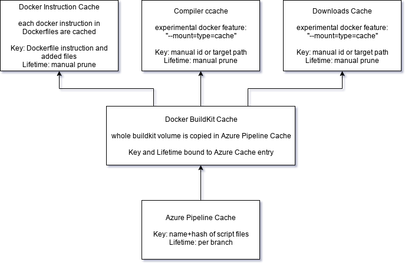

ASWF CI Working Group

Meeting:   16 October 2019

# Attendees

* Daniel Heckenberg (Animal Logic, TAC Chair)
* Michael B. Johnson (Apple)
* Jean-Francois Panisset (VES Technology Committee)
* Trevor Thomson (Blue Sky)
* Jeff Bradley (Dreamworks)
* Michael Dolan (OCIO / Sony Imageworks)
* Brian Cipriano (OpenCue / Google)
* Dave Fellows (Microsoft)
* Aloys Baillet (Animal Logic)
* Doug Walker (OCIO / Autodesk)
* Dan Bailey (ILM / OpenVDB)

# Agenda & Notes

## ASWF CI Goals for Year 2019  [0:00-0:10]

* Linux, Windows, Mac platform support

* GPU CI support

* CMake best practice

    * Craig Scott CppCon presentation [slides](https://github.com/CppCon/CppCon2019/blob/master/Presentations/deep_cmake_for_library_authors/deep_cmake_for_library_authors__craig_scott__cppcon_2019.pdf), [presentation](https://www.youtube.com/watch?v=m0DwB4OvDXk)

    * CMake minimum version?

    * Vcpkg presentations at CppCon: [2018 Part 1](https://www.youtube.com/watch?v=sBP17HQAQjk) [2019 Part 2](https://www.youtube.com/watch?v=_5weX5mx8hc)

        * Package management as a separate group of people from package developers

        * Should we aim to provide packages / package management system: from that presentation the answer would be "no", make sure to play nicely with major package management systems.

        * Tension between "always use latest version" vs VFX Reference Platform (vcpkg implements former)

* Integration / top of tree builds

* Dependency management

* Testing with commercial components?

    * On hold until we have a project use case.

## Follow ups: [0:10-0:30]

* GPU-enabled tests (Michael, Andrew, Sean)

    * Michael: Put in a ticket with lf-releng to set up AWS-based GPU enabled build agent, will start running GPU test runs once that is done.

    * Sean committed to helping with AWS resources

    * Andrew said LF releng working on dynamic provisioning for build resources

    * Michael: initially target a single Linux build to run GPU tests. There is interest on exploring on Mac and Windows, for instance OCIO has DirectX renderer, and when OpenGL fully goes away on macOS will need a Metal renderer.

    * Doug: differences in OpenGL implementations between platforms will only show up when you run tests on multiple platforms.

    * MacStadium: would we need to provision a bare metal instance? Wave: could help with that. Would need some kind of test matrix on Windows / Linux to see what would be required on the Apple side. Michael: can provide current OCIO platform matrix.

    * Azure, AWS and GCP offer Windows GPU-enabled instances, but of course they are not free.

    * Don’t think that WIndows containers support GPU acceleration

        * DirectX is supported: [https://docs.microsoft.com/en-us/virtualization/windowscontainers/deploy-containers/gpu-acceleration](https://docs.microsoft.com/en-us/virtualization/windowscontainers/deploy-containers/gpu-acceleration)

* ASWF Docker images (Aloys)

    * Azure Pipelines performance & caching

    * Windows containers are very slow! [https://github.com/jfpanisset/windows-container-test](https://github.com/jfpanisset/windows-container-test)

        * Dave: could put us in touch with Azure DevOps team to discuss performance

    * macOS Docker doesn’t support macOS containers as far as we know

    * Aloys: working on Qt build for a few weeks within Docker image, found that builds were running over 6h limit of free Azure Pipelines account. So restructuring to split building the packages from building the images. So one step to build boost, Python, Qt, create Azure artefacts, then another build that uses the artefacts to create a Docker container. So don’t have to "rebuild the world" when adding to the Docker images.

        * https://github.com/aloysbaillet/aswf-docker/tree/split-packages-from-image-builds

    * Limitations on what Azure Pipelines package management supports for public pipelines / repos.

    * Could build Qt locally and push to Azure packagement management for instance.

    * Still working on this

    * Working on using Azure caching to save build time

    * Should be no visible changes to the actual Docker images, but will improve and optimize the build process.

    * Should be able to advertise the work within a week to the TAC mailing list.

    * Daniel: Qt is probably the most complicated dependency, and is typically an optional dependency. Will be a good accomplishment to get that resolved.

    * Daniel: goal is to make something that is stable and relatively easy to maintain. May need to resource additional build resources (more CPU cores / RAM for instance for builders). Would get build / test results faster. (OpenVDB already asked for that). Dan: yes faster builds are useful, for now relying on multiple builds in parallel.

    * Aloys: Azure caching and [ccache](https://ccache.dev/) are both useful, but slightly tricky to get working together.  

    * Aloys: Docker caching for image build

    * Dan: [Travis CI has a great ccache implementation](https://docs.travis-ci.com/user/caching/#ccache-cache) Works best when there’s native support in the CI system

        * Azure pipeline caching ccache example: [https://docs.microsoft.com/en-us/azure/devops/pipelines/caching/?view=azure-devops#ccache-cc](https://docs.microsoft.com/en-us/azure/devops/pipelines/caching/?view=azure-devops#ccache-cc)

    * Daniel: this is also relevant for project builds. Dave: could help to put in touch with Azure DevOps team to provide expertise. Perhaps could have someone from this team be more directly engaged with ASWF projects.

* How to deal with secrets vs forks?

    * Dan: seems to work with OpenVDB. There’s a toggle in Azure Pipelines setup, there’s an accepted mindset that allowing your fork to access your secret is still better than just having secret being in plaintext since a fork / PR does create some kind of "paper trail" that someone is accessing the secret. Trying to remember how that got done in OpenVDB. Daniel: did that get worked through with lf-releng? Can use existence of secret variable to conditionally execute steps of the build.

    * Brian: also enable option to share secrets with forks in OpenCue (secret to push to Docker Hub)

## CI Updates for Projects [0:30-0:40]

* OpenEXR

* OpenCue

    * Brian: No major updates, trying to expand access to Azure DevOps project access, running into some permission problems, since using a "personal" project owned by himself / Google Azure Pipelines org. So want to transfer to ASWF releng Azure Pipelines org. Michael: but you won’t have admin access to the project then, so you have to go through lf-releng to manipulate the Azure Pipelines project.

    * Daniel: is that working OK? Michael: it’s working pretty well, worked through a few hiccups, lf-releng team is usually pretty responsive, changes happen within a day or two. Would still be useful to have more privileges, for instance can’t kick off manual build the way they used to.

    * Doug: admin capability could be useful in some cases. Also a bit of a bumpy road getting the DCO / CLA infrastructure in place (on the GitHub side). Had a DCO webhook in place, but turned out it wasn’t correctly integrated with easycla. Still a bit of a black box, somewhat concerned that contributors might be discouraged from contributing to the project. Don’t want contributors to get stymied by the CLA process. Daniel: we definitely don’t want barriers to contribution.

* OpenColorIO

    * Doug: admin capability could be useful in some cases. Also a bit of a bumpy road getting the DCO / CLA infrastructure in place (on the GitHub side). Had a DCO webhook in place, but turned out it wasn’t correctly integrated with easycla. Still a bit of a black box, somewhat concerned that contributors might be discouraged from contributing to the project. Don’t want contributors to get stymied by the CLA process. Daniel: we definitely don’t want barriers to contribution.

    * Michael: now using a nightly cron for SonarCloud builds if there has been a change to the repo, and a weekly forced run to catch changes to upstream dependencies.

* OpenTimeLineIO

* OpenVDB

    * Dan: moved up to latest VFX Reference Platform 2020 for "top of tree" testing, dropped the oldest one, so getting rid of 2017.

    * Experimenting with GitHub actions, when it goes live in November might want to switch to that from Azure Pipelines. Can define multiple different workflows, for instance to automate creating releases. Trying to unify everything under a single CI system. Still a few features missing, for instance "secrets in forks" is not available yet. Will leave in trial mode until GitHub Actions is out of Beta.

    * Aloys: no testing available yet. Still early days, but most of what OpenVDB needs is already there.

    * Daniel: currently no support for external build agents. Dan: they seem to be working on that. Lots of commonality with Azure DevOps platform.

    * Michael: Larry Gritz seems to have switched a lot of his OIIO infrastructure to GitHub Actions.

## CI Platform [0:40-0:50]

* Staging, Organisations, Roles, Access

    * Azure admin rights for projects

    * Easy-cla integration and troubleshooting?

* Support for Python3 transition

    * ASWF project Python3 status?

        * Michael: actively working on Python 3 bindings for OCIO, still a lot of work to do but active progress

        * Aloys: IlmBase does not compile with Python 3, planning to move to pybind11 first, not sure if they are working on this, but that’s an important foundation that needs to be done. Can we find out what is the timeline? Can we offer additional resources?

* devtoolset-6 deprecated since CentOS-7.7 ([https://groups.google.com/forum/?utm_medium=email&utm_source=footer#!topic/vfx-platform-discuss/_-_CPw1fD3c](https://groups.google.com/forum/?utm_medium=email&utm_source=footer#!topic/vfx-platform-discuss/_-_CPw1fD3c))

    * Strategies for supporting modern compilers?

        * A lot of facilities try to build on more modern compilers

        * Other forces are "pulling the compiler along"

        * Has there been other conversations in other forums? Aloys: hasn’t seen anything.

        * Dan: probably in context of VFX Reference Platform 2021

        * Jeff: are facilities successfully building against gcc 7 or 8? Dreamworks has been conservative due to past issues. Daniel: AL may try to use more modern compilers for performance critical code, but otherwise stick to VFX Reference Platform compiler. Aloys: using clang 7 for lots of places that interact with Maya. 

# Action Items

* JF: summary of vcpkg presentations

* Wave / Michael: Build matrix including Mac requirements for GPU testing

* Dave: Azure Pipelines contacts for Windows containers (JF) and caching strategies (Aloys)

* Daniel: Azure / Github admin rights and easy-cla hiccups.  How to streamline?

* Daniel: Python3 / pybind11 in IlmBase 

# Next Steps

* Follow up meeting: 13 November 2019

