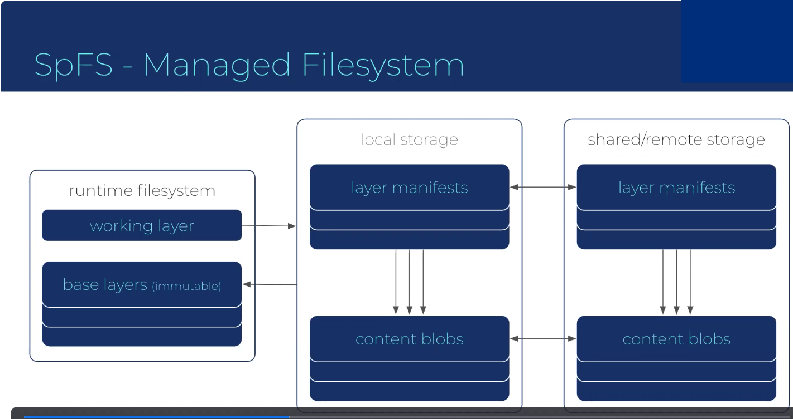
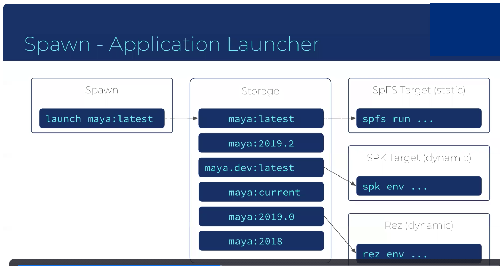

# ASWF CI Working Group

Meeting:   9 December 2020

[https://zoom.us/j/757849640?pwd=QzE1K2hrL2FHSFhKK3h5Z3BWTFJsZz09](https://zoom.us/j/757849640?pwd=QzE1K2hrL2FHSFhKK3h5Z3BWTFJsZz09)

## Attendees

* Daniel Heckenberg (Animal Logic, TAC Chair)
* Jean-Francois Panisset (VES Technology Committee)
* Aloys Baillet (Animal Logic)
* Andrew Grimberg (Linux Foundation Release Engineering)
* Sean Looper (AWS)
* Deke Kincaid (Digital Domain)
* Christopher Horvath (In flux)
* David Aguilar (Disney Animation)
* Michael Kessler (Epic Games)
* Robin Rowe (CinePaint)
* Michelle Halliwell (Disney Animation)
* Mark Boorer (ILM)
* Larry Gritz (SPI)
* Michael Dolan (OCIO, Epic Games)
* Ryan Bujnowicz (Pixar)
* Christian Schmidbauer (GC)
* Federico Naum (Animal Logic)
* Eric Reinecke (Netflix)
* Christopher Horvath (ILM)
* Stephan Steinbach (Pixar)
* Simran Spiller (Olive)
* Brian Cipriano (OpenCue)
* Jeff Bradley (DreamWorks)
* Brent Villalobos (DreamWorks)
* Stuart Bruce
* Neil Barber
* Christina Tempelaar-Lietz (OpenEXR)
* Brian Cipriano (OpenCue)
* John Mertic (LF)
* Ryan Botriell (SPI)
* Taisuke Tanimura (Netflix)
* Michael Brainerd (Digital Domain)
* Marshall Elfstrand (Apple)

## Agenda & Notes

### ASWF CI Goals for Year 2

* GPU Build & Test (success!)

* Mac, Windows & Linux (New focus)

* Packaging / Distribution

* Testing with commercial components

* CI WG is concerned with configuration and setup of the ASWF CI infrastructure and supporting systems such as the Docker (aswf-docker) containers, as well as any other dependencies. Initial focus was to get Linux / VFX Reference platform up and running in an easy to use and stable way. Extended to GPU-based build and test (using AWS CodeBuild), driven by requirements from OCIO. Next steps are extending platform support to macOS and Windows, currently mostly working on macOS. Also looking at packaging and distribution to provide dependencies for our projects (Docker not as well supported on other OSes), and want to make our projects easily consumable in studios.

* This session will be recorded for those who couldn’t attend. [Link to recording](https://zoom.us/rec/play/M1S5TyOQbUk-D8rkOenzjmGCEnp-ODGfajHCFlBulZNvXB5iuq6K0wGvKLcFlrU6vfZUU737PRJVv_j_.gR5_Z_uHOA8PKX4H).

### New Items

* Sony Pictures Imageworks SPK (Software package build, deploy, runtime environment manager) overview (Ryan Botriell)

    [Presentation PDF](SPK_SpFS-Pitch.pdf)

    * Presenting SPK, under development for the last year or so.

    * Runtime and Package Management

    * Overview

        * Package Management Wishlist

        * Technology Overview / Current State

        * Why We Are Here / Next Steps

    * Package Management Wishlist

    * User Experience

        * Don’t die cryptically when there are conflicts / issues

        * Do provide useful messages for debugging, provide solver tracing for debugging

        * Don’t introduce barriers for dev environments and one-off testing

        * Do provide "hackable" runtimes, allow developers to produce environments for small batch testing and fast iteration

        * Don’t require long build or setup times to establish environments

        * Do implement fast, lightweight environments for build, and run

        * Don’t require all variants to be built at release time

        * Do recognize source packages and build new variants on-demand

    * Package Definitions

        * Don’t have complex version ordering semantics

        * Do have number-based version ordering

        * Don’t require all releases to go directly into production

        * Do support pre and post release workflows

        * Don’t distill all packages to a version number

        * Do enable describing all compatibility vectors

        * Don’t expect all software to be cleanly separated

        * Do support bundled / embedded software in one package (eg DCC)

    * Runtime Environment

        * Don’t require all processes to share a single runtime

        * Do support per-process configuration of the software

        * Don’t make identifying the current runtime software tedious

        * Do provide a single, predictable filesystem tree

        * Don’t over-isolate from the host system

        * Do support simple access to common resources

        * Don’t require environments to be rebuilt from scratch

        * Do support natural platform definition, incremental updating

    * Storage and Distribution

        * Don’t require re-transfer, duplicate storage for incremental updates

        * Do deduplicate artifacts at the file level

        * Don’t require mothership access in all cases

        * Do support localization and export/bake workflows

    * Consumption and Stability

        * Don’t recommend unsafe deletion of packages

        * Do have safe deprecation workflows for yanking

        * Don’t allow previously successful solves to fail or ignore situations that a human can reason as successful

        * Do implement a backtracking solver (that is exhaustive)

        * Don’t recommend dynamic environments in production or workflows that can cause unexpected changes to the production environment

        * Do support deterministic storing and identification of environments

    * Technology Overview / Current State

    * Components

        * Spawn : extensible app launcher

        * SPK: package manager

        * SpFS: managed filesystem

    * SpFS - Managed Filesystem

        * Manages the contents of /spfs per-process

        * Uses overlayfs to isolate base content from edits

        * Efficient digest-based storage (per file deduplication)

        * Conceptually Docker + Git

        * The key technology underneath SPK that enables a lot of the features

        * Major components: runtime filesystem (working layer, base layers (immutable), local storage (layer manifests, content blobs), shared / remote storage (layer manifests, content blobs)

        

    * SPK - Package Manager for SpFS

        * Each package is stored as an SpFS layer

        * Packages are described in YAML

        * Backtracking, traceable solver

        * Variant support, with source packages and on-demand building

        * Compatibility beyond the version number

        * Deprecation workflows

        * Etc…

    * Spawn - Application Launcher

        * Focused on storage / organization of launch targets

        * As well as migration / testing of multiple runtime systems

        * First-class representation of development environments

        * Supports conversion between systems, is extendable

        * Moves a large corpus of shell and Perl scripts on NFS to a more modern infrastructure

        * Provides the "baking" workflow

        

    * Recap

        * Software platforms that are isolated just enough from the host

        * Fully described compatibility semantics with debuggable solver

        * Cloud-friendly software publish and distribution

        * User-friendly launch and version management solution

    * Why We Are Here / Next Steps

    * Stronger Together…

        * Recognize that these are problems that we all face

        * Often these tools take a backseat to production work, and don’t get the resources that they need

        * We’ve seen that other studios have at least thought about similar solutions

    * The Pitch

        * We are marching ahead with this software as we speak

        * And are willing to open source what we have

        * We can also provide our current roadmap as a starting point for the community, and lead the development effort going forward

        * We’re looking for (eventual) commitment from others before we do that…

        * As we don’t want to be solely responsible for maintaining this project if it becomes public (it’s easier to do that internally)

        * If there is interest, we can provide a version for initial evaluation

        * Chicken and egg: need to demonstrate external interest to justify effort to open source

    * Q&A / Discussion

        * Chris: do third party build system management. The goals described seem to be wholly served by Nix, how is this different from Nix, and what comparisons would you draw. Ryan: no layered file system, very distributed like Rez, not easy to figure out how it resolves. Also looking for a packaging format that works better for VFX developers. The package format in Nix is challenging. But yes, there is a lot of crossover, and including with every other package manager. But every other package manager comes with caveats in VFX facility environments. Nix only supports a single package hierarchy, doesn’t support having multiple versions of a package active at the same time? Need to create "intrusive" build scripts in Nix. No system is a panacea, but systems tend to be as useful as they have momentum behind them, the first evaluation is the set of dependencies you need to support it. Does it already have the “hard things” incorporated (like TensorFlow). What is the likelihood of a new package manager gaining momentum compared to existing solutions.

        * Daniel: VFX/Animation industry has specific requirements for supporting large binary commercial applications, places a set of constraints that are typically not supported by many packaging solutions. Needing to pin to specific Maya versions, need to support multiple sets of dependencies in parallel. That’s the crucial differentiating problem that may justify an industry specific solution.

        * Is there a centralized component to "path resolution"? Current iteration localizes files, so all client side, same as cloning a git repository. Regardless of running off NFS or local, benefit of a single filesystem library is that LD_LIBRARY_PATH is always a single entry: /spfs/lib and deferring to overlayfs for client side resolution of which file to actually look up. No centralized component.

        * Mark: ILM developing a similar system to SPK, have been working on a document to describe the differences, some fundamental differences (level of isolation from the host system, ILM feels that complete isolation from the host system is a desirable goal to provide fully reproducible build artifacts)

        * Federico: have we looked at the containerization system [singularity](https://singularity.lbl.gov/), container runtime that blurs the line between what you have in on the host and in the container. Doesn’t require root, used in the HPC space, so definitely appropriate to HPC. Seems to have a lot of momentum.

        * Is SpFS Linux Specific? Larry: yes, so more eyes on it / different expertise may allow extension to other platforms (Windows, macOS), looking for ideas to extend to other platforms.

        * If you have an artist jumping between shows, do you have to pre-setup the machine? Ryan: trying to prove the workflow initially, once the environment is resolved, can identify every file you need, can be copied on demand from NFS, web repository… Trying to reduce the load time for an application, don’t need to localize all the time in the future.

        * Do you cache tools? Ryan: it depends what you are loading and from where. "Sometimes"

        * Larry: use Avere for caching, but depends where things are mounted from and what server they are on.

        * Ryan: wanted to prove the workflow of localizing things first and running it there first. Trying to make the software more reliable in the fact of "networking slowness", or not have access to the main NFS repository. Did you see large gains with localization? Yes, but not sure yet if it’s fully worth it. But want to support both scenarios, have long had a need to isolate from NFS.

        * Daniel: obviously lots of interest, great presentation. Demonstrating how this system is different from what else is available. Will require deeper discussions, how should we follow up the discussion. Larry: this is likely the correct forum, in these meetings, the #wg-ci channel in Slack or the TAC mailing list. Would like to see some interest from other facilities, demonstrate that ASWF can be a forum to help the developer experience at every company. Would like to see a similar effort from the community similar to what happened to the CI infrastructure. "Chicken and egg problem". SPI is prepared to open source if the community is prepared to help / demonstrate that evidence, it needs to be a community effort. Also want the feature requests / feedback / contributions of different area of expertise, but not only that, want it to be a real community project. This is being deployed at SPI, but early enough in project that it can still be influenced in major ways, so this is the right stage to reach out to the community. Lots of room to steer it, now is the right time to do this.

        * Christopher: how difficult would be to try out in an example environment? How long would it take to get up and running? Aloys: could we be able to use this for the small number of packages for the ASWF docker effort, could be a good test environment. For the ASWF docker containers, should be "as simple" as changing /usr/local/ to /spfs, but doesn’t help with macOS / Windows support, so will still require a lot of work by Mac / Windows experts. But interested in applying it to the ASWF Docker effort.

        * Ryan: there is a path where SPI can provide a couple of RPM packages that can be installed and try the current version, and a ZIP file with some documentation. Larry: having many people have their hands on it would help with authoring the YAML package descriptions. A limitation of other packages with 10K recipes are not the specific packages for a typical VFX environment, but recipes developed by our industry members would be useful, since we all pretty much depend on the same packages. Would need to build that infrastructure of packages from the ground up.

        * Daniel: various channels identified with the CI WG are the right place to have follow up discussion, we are going into Holiday session, next meeting of CI WG will be a good place to continue the discussion.

* CentOS transition to Stream model

    * Skipped due to lack of time

### Follow ups

* GPU Build & Test

    * Document OCIO setup in Template project (JF)

    * Any updates on GitHub secret handling? (Andrew)

* ASWF-docker updates

    * Documentation

    * [Docker Hub repository changes](https://www.docker.com/pricing ).

        * Application for Open-Source status? (Andrew)

* Mac CI

    * MacStadium / Developer Transition Kits

        * JF to prototype integration between an ASWF project and Orka build: in progress, hoping to have sample build of OCIO before EOD

        * [Basic design based on VM](https://docs.google.com/document/d/1ZdeIprFKR4nR8tK4wImuobSbVRLwblNtTmwePj3OFvc/edit#heading=h.txn0odl0ldk)

        * Jira ticket open to share credentials with LF RelEng team, add LF RelEng as admin on the MacStadium subscription

        * [M1 based Mac Minis available soon from MacStadium](https://www.macstadium.com/m1-mini)

        * [AWS now offering ECS Mac instances for CI builds](https://aws.amazon.com/ec2/instance-types/mac/)

* Project feedback

### Action Items

## Next Steps
