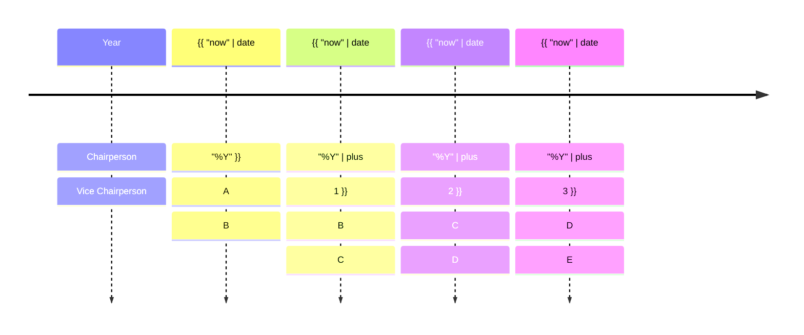

# TAC Roles

* TOC
{:toc}

The TAC has several leadership roles, which provide both the TAC and the hosted projects and working groups with 
support and oversight to ensure a healthy ecosystem. This document outlines those roles and the processes
regarding appointment and selection.

## Chairperson and Vice Chairperson.

Per the [Directed Fund Charter]({{ site.directed_fund_charter_url }}), the role of the TAC Chairperson is as follows:

> The TAC representatives will elect a chair to preside over meetings, ensure minutes are 
taken and drive the TAC agenda with input from the TAC representatives

The Chairperson role serves a term of one year. A Vice Chairperson role has been established to ensure continuity and increase leadership support. The Vice Chairperson both supports and shadows the Chairperson so that they can serve as Chairperson the following year. The chart below illustrates this.

The TAC annually will hold an election to elect a new Vice Chairperson, following the [election guidelines]({{ site.election_guidelines_url }}). The TAC Chairperson and TAC Vice Chairpeson must be voting members of the TAC at the time of the election.

If a TAC Chairperson or Vice Chairperson needs to step down for any reason, they must provide notice to the TAC with a one-month notice to the TAC. If the Chairperson would step down, the Vice Chairperson would assume those responsibilities. If the Vice Chairperson steps down or the Vice Chairperson role is vacated due to the Chairperson stepping down, the TAC would elect a new Vice Chairperson.

## TAC Representative to the Governing Board

The TAC Chairperson serves as the TAC Representative to the Governing Board. However, if the TAC Chairperson wishes to delegate this responsibility, they may appoint a TAC Representative to the Governing Board, subject to TAC Approval.

The TAC Vice Chair serves as the Alternate TAC Representative to the Governing Board. However, if the TAC Vice Chair wishes to delegate this responsibility, they may appoint an Alternate TAC Representative to the Governing Board, subject to TAC Approval.
