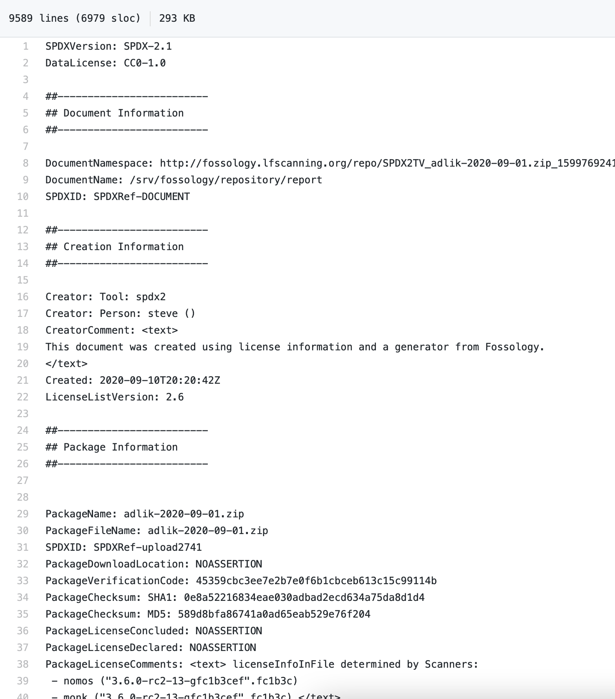
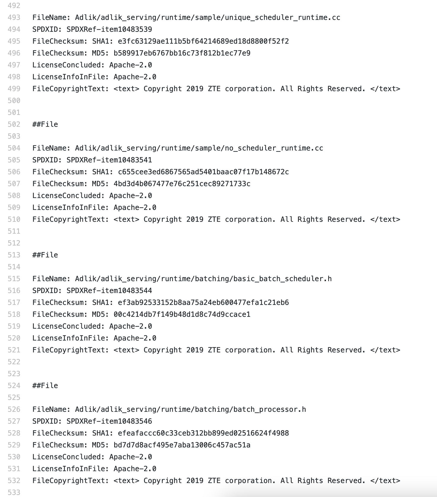
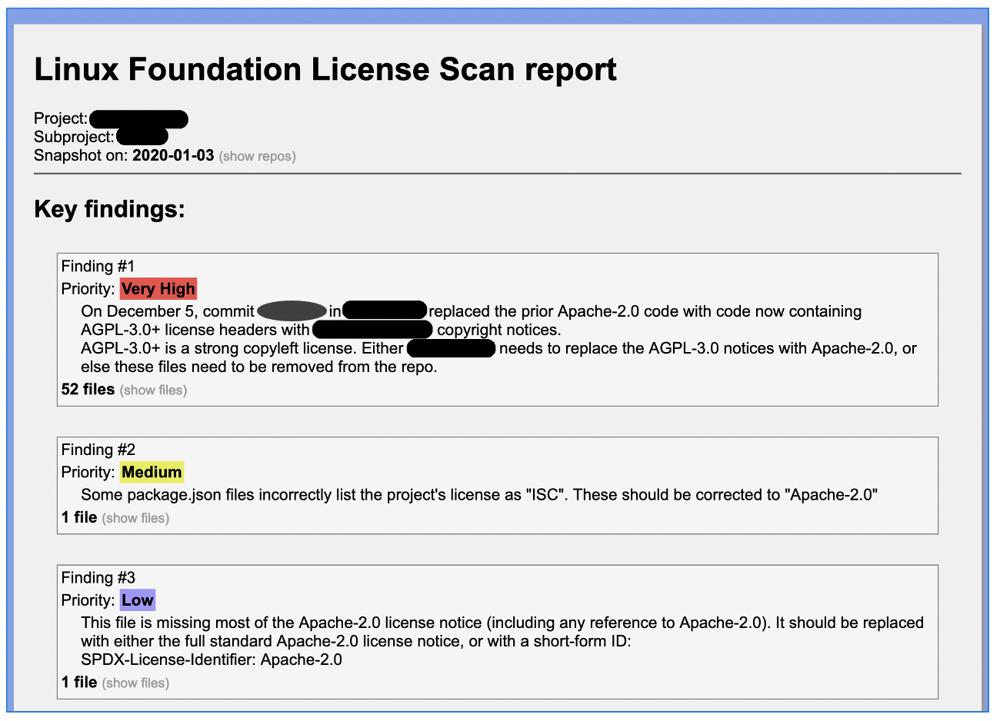
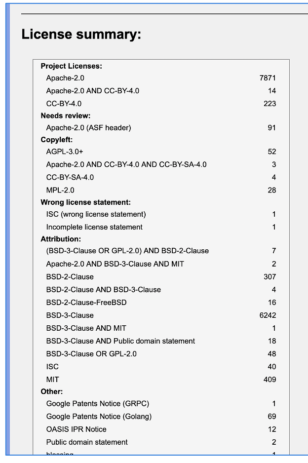
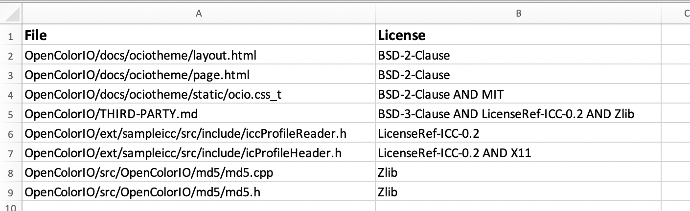
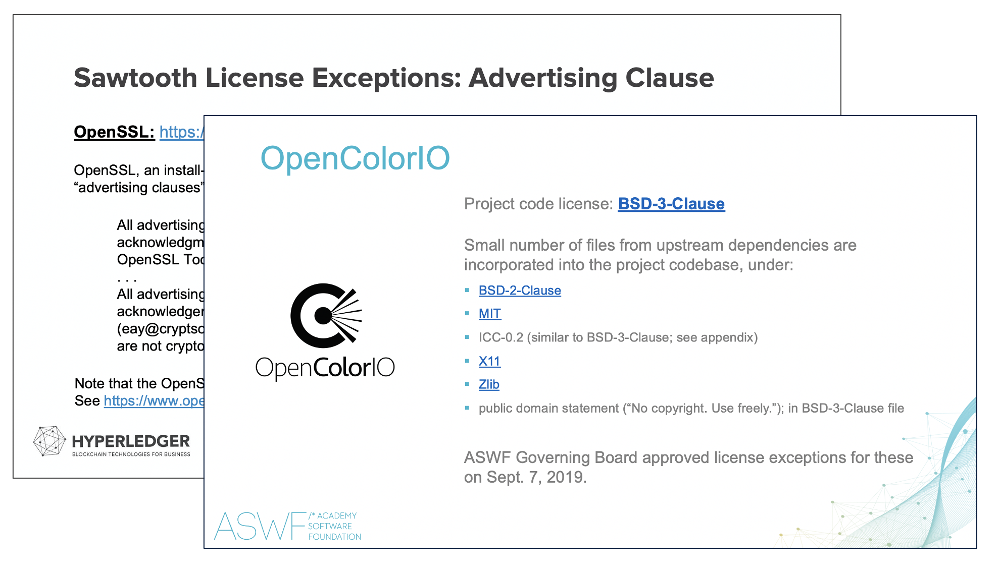

# License Scanning and Analysis Support Program

* TOC
{:toc}
## Support plan summary

For the projects described below, the following actions will be
performed:

1.  Run recurring scans, on the schedule described below, of the
    project’s codebases using Fossology

2.  Analyze and clear licenses, notices and copyright statements
    contained in the project codebases

3.  Publish SPDX documents with the license conclusions and copyright
    statements at <{{ site.lfscanning_repo_url }}>, for broader community use in their own compliance
    processes

4.  Produce summary reports for project leads / maintainers, with
    limited public visibility (or optionally public at the project’s
    discretion) with the following:

    1.  catalog and summary of licenses detected, categorized and
        identifying corresponding files

    2.  description of key findings, particularly relating to
        incompatibility with project licenses and project IP policies

    3.  recommendations for remediation where necessary

    4.  guidance for best practices to improve project licensing notices
        and add statements to files without existing notices

5.  Correspond with developers to address questions about findings,
    where possible without providing legal advice (see “Notes” section
    below)

6.  Upon request from the project, up to approximately two times per
    year (such as prior to significant releases), assist with formal IP
    policy approvals under the project’s charter:

    1.  document the license scan findings as “license exceptions” for
        approval by the Governing Board or technical leadership
        committee, as applicable

    2.  prepare summary slide deck describing the requested exceptions

    3.  present to project Legal Committee or similar leadership body to
        describe the requested exceptions and facilitate approvals under
        the charter

### Stretch goals

Will perform where feasible, subject to available resources and time:

1.  Run “red flag” pre-intake scans, for net new projects:

    1.  Run Fossology scan of incoming codebase, prior to import into a
        project-controlled repository

    2.  Identify any “red flag” or “high priority” issues that would be
        likely to present a significant problem for license
        compatibility

    3.  Correspond with developers regarding these issues where
        remediation is recommended

2.  Parallel to Fossology scans, also run dependency scans using
    WhiteSource:

    1.  review and clear scanning results, researching potentially
        concerning findings as appropriate;

    2.  flag key issues to the project leads / maintainers;

    3.  work towards providing standardized reports of all dependencies;
        and

    4.  work towards providing vulnerability findings as part of
        results.

Note that WhiteSource has recently been incorporated into the license
scanning workflow, so some of this functionality will be subject to
continued development of the scanning workflow automation.

### Notes

-   The Linux Foundation is not able to provide legal advice to project
    community members. The support program is focused on providing
    transparency about identified project licenses, and where possible
    describing general community understandings of license requirements.
    However, questions about e.g. whether a license is legally okay to
    use must be directed to the contributor’s own legal counsel and/or a
    project’s Legal Committee.

-   The support program utilizes various automated tools supplemented by
    manual reviews. However, like any other scanning tool or process,
    the LF cannot guarantee the completeness or accuracy of the license
    scanning results, and does not guarantee that all possible license
    issues in a scanned codebase will be identified.

### Dependencies on other LF and project teams

-   Will periodically need assistance from project manager or similar
    project staff support, to coordinate on preferred methods for
    communications with appropriate project community members.

-   May periodically need LF IT assistance for configuring certain types
    of scans, for those that are dependent of CI/CD processes that are
    managed by LF IT (none presently anticipated for current projects /
    scan types)

## Exhibits

1.  Screenshots from example SPDX document

2.  Screenshots from example scan report for developers

3.  Screenshots from example board decks

### Exhibit 1

**Screenshots from example SPDX document**

### Exhibit 2

**Screenshots from example scan report for developers**

Key findings and recommended actions:

Summary of findings:

Spreadsheet with detailed findings:

### Exhibit 3

**Screenshots from example board decks**

