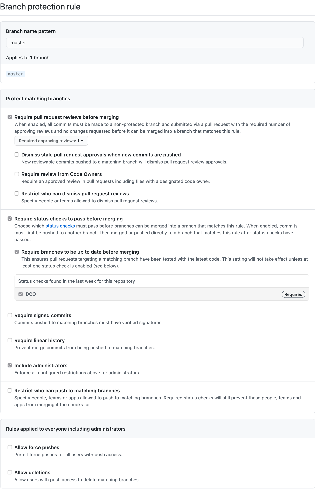

# GitHub

* TOC
{:toc}

{{ site.foundation_name }} projects generally use GitHub for code hosting and issue management. GitHub organizations for hosted projects are owned and administered by the Linux Foundation staff, including the Linux Foundation release engineering team, to ensure the sustainability of the infrastructure. 

This document outlines project policies and procedures using GitHub for code hosting. In addition, the Linux Foundation release engineering team maintains [documentation](https://docs.releng.linuxfoundation.org/en/latest/) on its services, policies, and procedures.

## New project or repository

When a new project or repository is to be added, please [submit a request]({{ site.helpdesk_url }}) to facilitate the process.

### Code license scan

If adding the new project or repository will include a significant contribution, requesting a code license scan is highly recommended before bringing the code in. This scan will look for and will provide recommendations (or, in some cases, required prior remediation) for:

- The presence of third-party licenses (OSI-approved or otherwise) that might be considered incompatible with the project's license
- Presence of headers with the project's designated license(s) and preferred copyright notices in project files (refer to the [License Specification in the Contribution Guidelines](/process/contribution_guidelines.md#license-specification) for more information)
- Any other best practices guidance 

Typically code license scans are a quick turnaround, but that might take longer for more significant code bases.

### Repository setup

Generally, most projects utilize the existing {{ site.foundation_name }} GitHub organization, especially if they intend to have a single repository. This practice enables the easiest discoverability of the project.

If a project anticipates having multiple repositories, the {{ site.foundation_name }} staff can provision a GitHub organization specific to that project. The same policies apply to the administration and access control with either option.

### Code migration

There are two strategies for migrating the code to a hosted project repository.

- The best practice is for the {{ site.foundation_name }} staff to provision a new repository, where the new code can be contributed to as a pull request. 
- If preserving the commit history is important, the repository can be transferred using the [GitHub transfer repository](https://docs.github.com/en/github/administering-a-repositoriesitory/transferring-a-repositoriesitory) process. If doing this, before the transfer, you must add a commit to the repositories providing a DCO signoff for all previous commits. The easiest way is to check in a file called `past-dco-signoff.txt` with the contents below...

```
I, <AUTHOR NAME> <<AUTHOR EMAIL>> hereby sign-off-by all of the commits prior to and including <COMMIT_HASH> to this repo subject to the Developer Certificate of Origin (DCO), Version 1.1. 
```

## Settings

Generally, the following settings apply to all hosted project repositories and organizations.

### DCO

By default, all GitHub repositories have both the [GitHub DCO App][] installed and [commit signoffs enabled][GitHub commit signoff policy]. DCO guidelines for hosted projects are outlined in the [contributing guidelines](/process/contributing#Code+License+Identification).

### CLA

All projects requiring a Contributor License Agreement (CLA) leverage [EasyCLA](https://easycla.lfx.linuxfoundation.org) for automated management. Documentation on EasyCLA can be found [here](https://docs.linuxfoundation.org/lfx/easycla/v2-current).

### Permissions

Projects should define a COMMITTERS.* file for indicating committers that can merge in code to a repository. The list of committers is generally approved by the TSC or the committers, aligning with the requirements described in the project's governance. Permissions are managed using GitHub teams, where the TSC or committers will have a team, and that team will be given ['maintain' permission](https://docs.github.com/en/github/setting-up-and-managing-organizations-and-teams/repositoriesitory-permission-levels-for-an-organization#permission-levels-for-repositoriesitories-owned-by-an-organization) on the repositories.

The best process for adding a new committer is to have that committer issue a pull request to add their name to the COMMITTERS.* file, where the required number of TSC members or committers can +1 the request, and the TSC chairperson can merge in it and can add the individual to the team.

### Adding read-only members to an organization

By default, hosted project GitHub organizations and repositories have enabled the [invite-contributors](https://probot.github.io/apps/invite-contributors/) GitHub app installed, which will automatically send an invite to anyone with a successful merged pull request to join the organization as a member. The *member* permission is read-only by default, but this enables members to have issues and pull requests assigned to them and be tagged inside of issues and pull requests.

### Branch protection

The below branch protection settings on the `master` or `main` branch are enabled by default.



## Issue management

Generally, projects leverage GitHub Issues for issue management. While each project is encouraged to develop its issue management strategy, below are some best practices for issue management.

### Issue and pull request templates

Using an issue or pull template request helps ensure the project maintainers have the right context and information to process these requests. More information on how to set this up is in the [GitHub issue and pull request documentation](https://docs.github.com/en/github/building-a-strong-community/about-issue-and-pull-request-templates).

### CODEOWNERS

Defining a CODEOWNERS makes an automated process for assigning new pull requests to the right committers for review. Read more in the [GitHub CODEOWNERS documentation.](https://docs.github.com/en/github/creating-cloning-and-archiving-repositoriesitories/about-code-owners#about-code-owners)

### Project boards

Issue triaging can be complicated and overwhelming, especially when managing a project to a release point. For projects that utilize an organization, having a single view of open issues across repositories is also very helpful in release management.

GitHub has the functionality for doing either a [single repository project board](https://docs.github.com/en/github/managing-your-work-on-github/creating-a-project-board#creating-a-repositoriesitory-project-board) or a [multiple repository project board](https://docs.github.com/en/github/managing-your-work-on-github/creating-a-project-board#creating-an-organization-wide-project-board). Automation capabilities can also be leveraged to aid in using project boards.

## Using GitHub

All the projects hosted at the {{ site.foundation_name }} are hosted on GitHub, a code collaboration and hosting service used by millions of open-source projects globally. If you are new to GitHub or open source, check out the resources below.

- [Create a GitHub Account](https://docs.github.com/en/get-started/start-your-journey/creating-an-account-on-github).
- [How to make a Pull Request by example](https://docs.github.com/en/get-started/start-your-journey/hello-world).
- [First-timers guide to contributing to open source](https://opensource.guide/how-to-contribute/).
- [Tutorial on how to make your first contributions to a git project](https://github.com/firstcontributions/first-contributions).
- Contributing to GitHub may be more accessible by using [GitHub Desktop](https://desktop.github.com/).

### Working with Markdown files

Markdown files (.md) are commonly used on GitHub for documentation and other non-code assets. They look similar to a document but have markings to allow for formatting. It can be easier to work with Markdown by using tools. You can find information on the types of elements used in GitHub Markdown [here](https://guides.github.com/features/mastering-markdown/).

There are also various tools you can use to help you see how your Markdown file will look when uploaded to GitHub. A good list of markdown editors can be found at [Awesome Markdown Editors & (Pre)viewers](https://github.com/mundimark/awesome-markdown-editors).

## Best practices for hosting code on GitHub

These practices will help you improve your GitHub presence to help you attract more users and developers to your project, secure your account, be precise about licensing, and maintain good housekeeping. Please issue a PR to add new recommendations or update existing ones.

* Use the [REPOLINTER](https://github.com/todogroup/repolinter) tool created by the TODO Group to identify common issues in GitHub repositories. 
* Ensure that every repo includes a LICENSE file. 
* Add a README file to your repositories welcoming new community members to the project and explaining why the project is useful and how to get started. Follow the guidelines in the [README checklist](https://github.com/ddbeck/readme-checklist) to create an excellent README file.
* Add a CONTRIBUTING file to your repositories explaining to other developers and your community of users how to contribute to the project. At a high level, the file would explain what types of contributions are needed and how the process works.
* Add the CODEOWNERS file to define individuals or teams responsible for code in a repository.
* Add a CODE_OF_CONDUCT file that sets the ground rules for participants’ behavior and helps facilitate a friendly, welcoming environment. While not every project has a CODE_OF_CONDUCT file, its presence signals that this is a welcoming project to contribute to and defines standards for engaging with the project’s community. Projects should leverage the default [Code of Conduct][] unless an alternate Code of Conduct is approved.
* Provide documentation on the release methodology, cadence, criteria, etc.
* Document your project governance and make it available on the project’s repo.
* Add a SUPPORT file to let users and developers know about ways to get help with your project. You can either add how and where security issues are handled in this file, put it at the project's top-level readme, or refer to security documentation.
* Archive inactive repositories to flag to your users and other developers that you’re not maintaining them.
* Setup [issue templates and pull request templates](https://docs.github.com/en/communities/using-templates-to-encourage-useful-issues-and-pull-requests/about-issue-and-pull-request-templates) that help you customize and standardize the information you'd like contributors to include when they open issues and pull requests in your repository.
* Identify who on the project will handle security issues (could be a team) and set up a separate email account.  Consider having the project become a CNA (CVE Numbering Authority).
* Use English as the default universal language for anything you publish on GitHub. You can support a second language, but English should be the primary language of communication to a universal audience.

## FAQs

### Why don't project members have `admin` permission on repositories or organizations?

As project communities and members look for the {{ site.foundation_name }} to provide a vendor-neutral space for collaboration, the staff are here to ensure that the fair and transparent governance that the project has put in place is adhered to. This can add a bit of overhead, but the tradeoff of showcasing transparent and consistent processes generally is considered a benefit to projects, and this also lowers the burden for a project to manage on its own.

If there are concerns about this, feel free to [submit a request][].

[submit a request]: {{ site.helpdesk_url }} 
[Code of Conduct]: /code_of_conduct
[GitHub commit signoff policy]: https://docs.github.com/en/organizations/managing-organization-settings/managing-the-commit-signoff-policy-for-your-organization
[GitHub DCO App]: https://github.com/apps/dco
